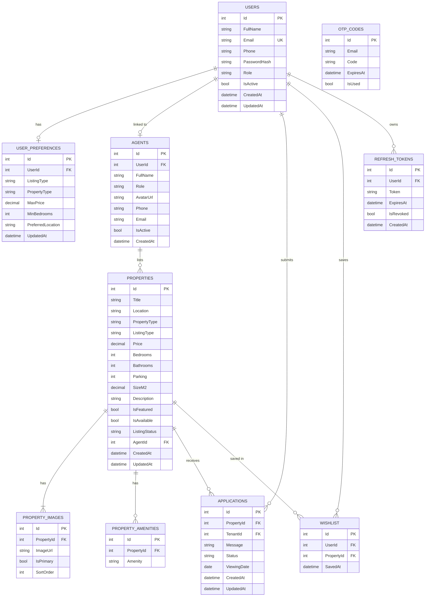
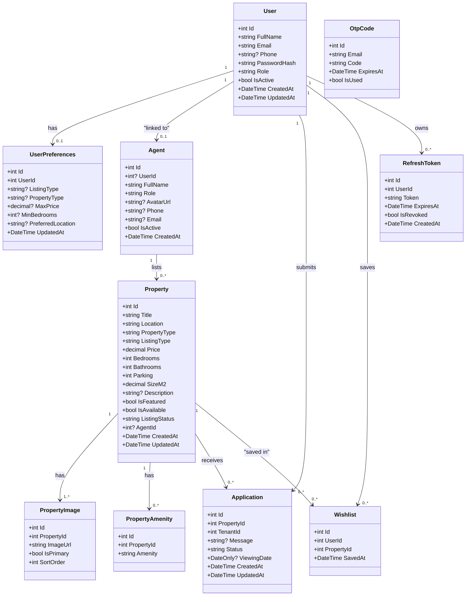
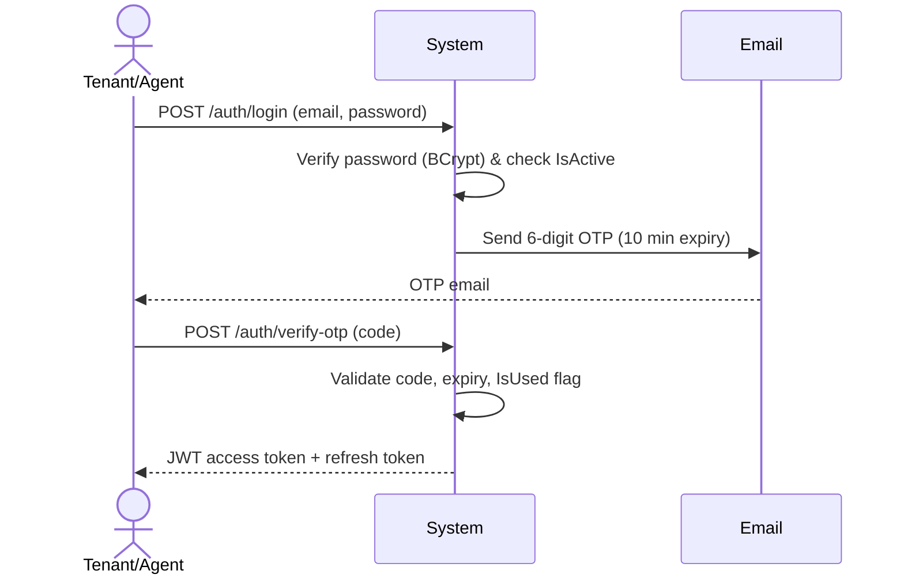
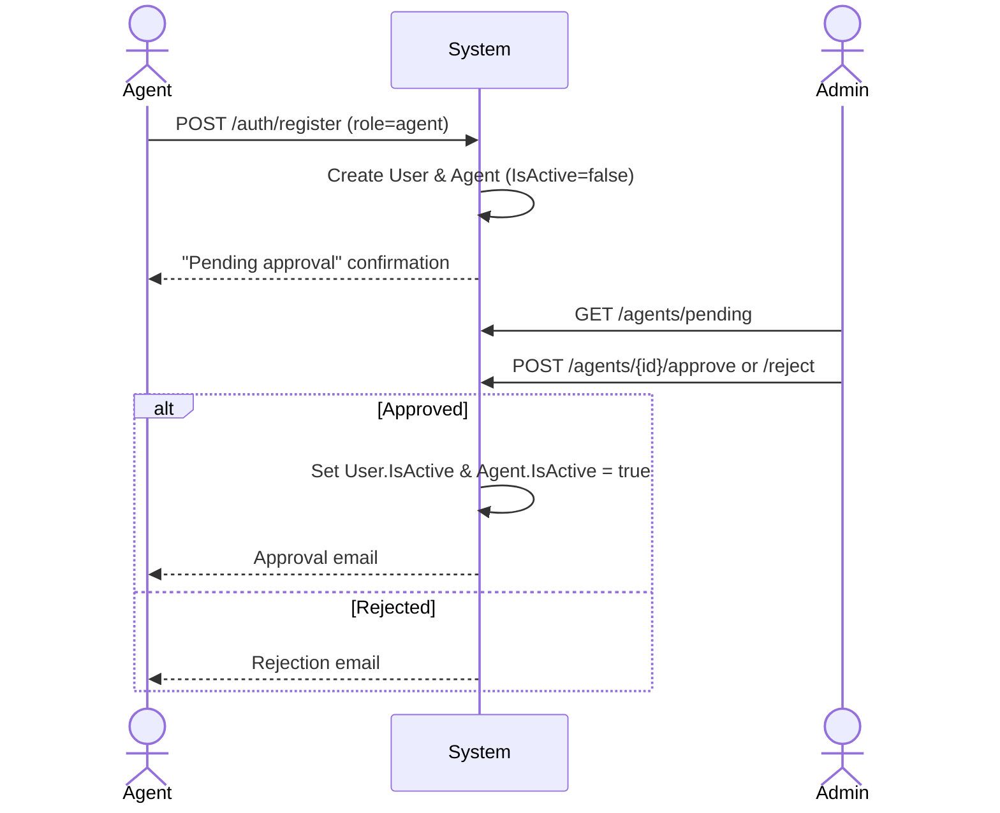
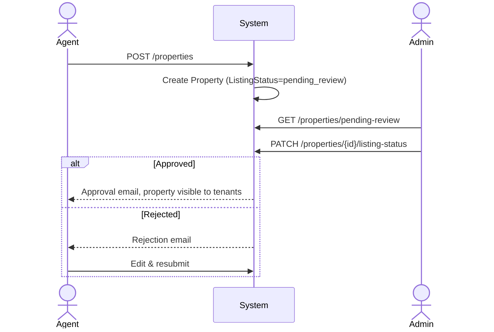
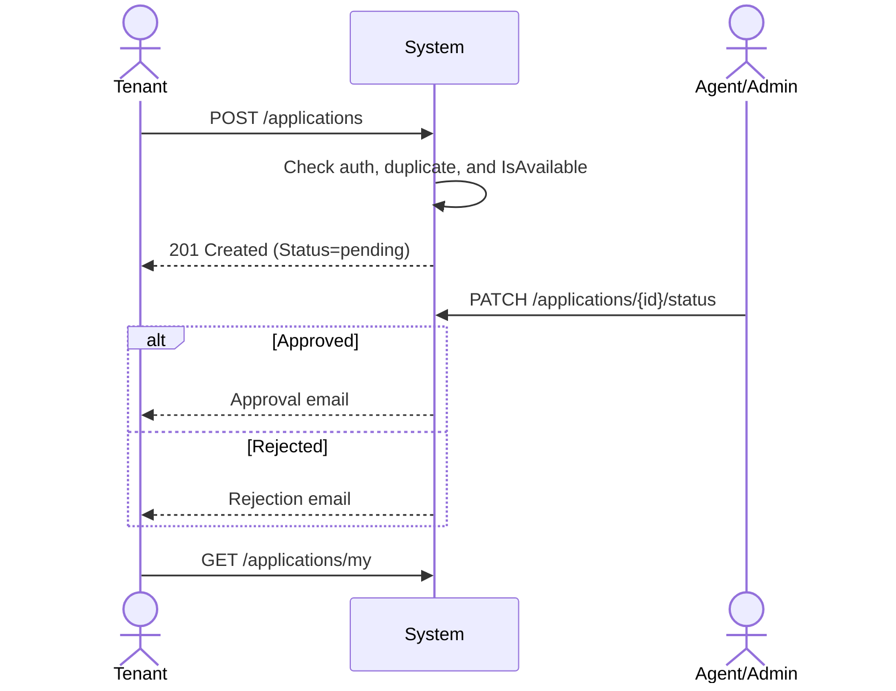

# PropRent Rwanda — Online Rental Property System

**Course Project Documentation**

| Member | Student ID |
|---|---|
| Familoni Emmanuel Eniola | 25951 |
| Chikeluba Stanley Kenechukwu | 25276 |
| Sarah Munyana | 29653 |
| Akendengue Oguizi Vann Alex | 26025 |

---

## Table of Contents

1. [Project Overview](#1-project-overview)
2. [Tech Stack](#2-tech-stack)
3. [System Architecture](#3-system-architecture)
4. [Features](#4-features)
5. [Entity Relationship Diagram](#5-entity-relationship-diagram)
6. [Class Diagram](#6-class-diagram)
7. [Activity Diagrams](#7-activity-diagrams)
8. [API Reference](#8-api-reference)
9. [Setup & Installation](#9-setup--installation)
10. [Project Structure](#10-project-structure)

---

## 1. Project Overview

**PropRent Rwanda** is an AI-powered online rental and property sales platform built specifically for the Rwandan real estate market. The system connects property agents, tenants, and administrators through a unified digital platform that streamlines the entire property lifecycle — from listing and discovery to application and approval.

The platform leverages artificial intelligence to provide:
- **Smart Property Matching** — ranks listings based on tenant preferences
- **AI Price Estimation** — compares similar properties to determine fair market value
- **PropBot Assistant** — a conversational AI chatbot for property queries

The system supports three distinct user roles, each with a dedicated dashboard and set of permissions:

| Role | Responsibilities |
|---|---|
| **Admin** | Approves agents, manages all users, approves/rejects property listings, oversees all applications |
| **Agent** | Lists properties for rent or sale, manages their own listings, reviews and responds to tenant applications |
| **Tenant** | Browses properties, saves to wishlist, submits rental or purchase applications, tracks application status |

---

## 2. Tech Stack

### Backend
| Technology | Purpose |
|---|---|
| .NET 10 / ASP.NET Core | REST API framework |
| Entity Framework Core | ORM and database migrations |
| PostgreSQL | Relational database |
| JWT Bearer Tokens | Authentication and authorization |
| BCrypt.Net | Password hashing |
| MailKit / MimeKit | Email delivery (OTP, notifications) |
| Swashbuckle (Swagger) | API documentation |

### Frontend
| Technology | Purpose |
|---|---|
| React 18 | UI framework |
| Vite | Build tool and dev server |
| React Router v6 | Client-side routing |
| Axios | HTTP client with interceptors |
| CSS (custom) | Styling — no UI library dependency |

### Architecture Pattern
- **Clean Architecture** — Core → Infrastructure → API layers
- **Repository-less** — Services access `AppDbContext` directly via EF Core
- **Interface-driven** — All services injected via interfaces for testability

---

## 3. System Architecture

```
┌─────────────────────────────────────────────────────┐
│                   React Frontend                     │
│         (Vite · React Router · Axios)                │
│                  localhost:5173                      │
└──────────────────────┬──────────────────────────────┘
                       │ HTTP via Vite Proxy
                       ▼
┌─────────────────────────────────────────────────────┐
│              ASP.NET Core Web API                    │
│         PropRent.API — localhost:5000                │
│  ┌─────────────┐  ┌──────────────┐  ┌────────────┐  │
│  │ Controllers │→ │  Interfaces  │→ │  Services  │  │
│  └─────────────┘  └──────────────┘  └─────┬──────┘  │
└────────────────────────────────────────────┼────────┘
                                             │
┌────────────────────────────────────────────▼────────┐
│                   PostgreSQL                         │
│         PropRentRwanda Database                      │
│   EF Core · AppDbContext · Migrations                │
└─────────────────────────────────────────────────────┘
```

---

## 4. Features

### Authentication & Security
- Email + Password login with mandatory OTP verification
- JWT access tokens (60-minute expiry) + refresh tokens (7-day expiry)
- Refresh token rotation with concurrent request queuing
- OTP rate limiting — max 1 code per 60 seconds per email
- Password reset via OTP email
- BCrypt password hashing
- Rate limiting — 10 req/min on auth endpoints, 120 req/min general

### Property Management
- Full CRUD for properties (admin and agent)
- Property types: Apartment, House, Studio, Townhouse, Commercial
- Listing types: For Rent, For Sale
- Multi-image support with primary image designation
- Amenities tagging
- Listing status workflow: `pending_review` → `approved` / `rejected`
- Availability toggle
- Featured property flagging
- Paginated, filtered, and sorted property search

### Applications
- Tenants apply to rent or enquire to buy
- One application per tenant per property (enforced at DB level)
- Application status: `pending` → `approved` / `rejected`
- Withdrawal of pending applications
- Email notifications to tenants on status change

### AI Features
- **Smart Matching** — scores properties 0–100 based on listing type, property type, budget, bedrooms, and location preferences
- **Price Estimator** — calculates estimated market value using comparable properties with location and type multipliers; returns verdict (fair/above/below market), explanation, and confidence level
- **PropBot** — context-aware chatbot pre-loaded with live property data; handles location searches, price queries, process explanations, and neighbourhood information

### Wishlist
- Save/unsave properties with toggle
- Wishlist persisted per user in database

### Admin Dashboard
- Approve or reject agent registrations
- Approve or reject property listings
- Manage all users (activate/deactivate)
- View all applications and update statuses
- Dashboard stats: total properties, available, applications, pending agents

---

## 5. Entity Relationship Diagram

The ERD below illustrates all database tables, their attributes, primary keys (PK), foreign keys (FK), and the relationships between them.



### Relationship Summary

| Relationship | Cardinality | Description |
|---|---|---|
| Users → UserPreferences | 1 to 0..1 | Each user optionally has one set of AI matching preferences |
| Users → Agents | 1 to 0..1 | A user registered as an agent has one linked Agent record |
| Agents → Properties | 1 to 0..* | An agent can list zero or many properties |
| Properties → PropertyImages | 1 to 1..* | Every property has one or more images |
| Properties → PropertyAmenities | 1 to 0..* | A property can have zero or many amenity tags |
| Properties → Applications | 1 to 0..* | A property can receive zero or many applications |
| Users → Applications | 1 to 0..* | A tenant can submit zero or many applications |
| Users → Wishlist | 1 to 0..* | A user can save zero or many properties (cascade delete) |
| Properties → Wishlist | 1 to 0..* | A property can be saved by zero or many users (no action on delete) |
| Users → RefreshTokens | 1 to 0..* | A user can have multiple active refresh tokens |
| OtpCodes | Independent | Stores OTP codes keyed by email — no FK to Users (supports pre-registration OTPs) |

### Key Constraints
- `Users.Email` — unique index
- `Agents.UserId` — filtered unique index (allows NULL, enforces uniqueness on non-null values)
- `Applications(PropertyId, TenantId)` — composite unique index (one application per tenant per property)
- `Wishlist(UserId, PropertyId)` — composite unique index (no duplicate saves)

---

## 6. Class Diagram

The class diagram below shows all domain model classes, their attributes with data types, and the navigational relationships between them with cardinality labels.



### Class Descriptions

| Class | Description |
|---|---|
| `User` | Core entity representing all system users regardless of role. Role field (`tenant`, `agent`, `admin`) determines permissions. |
| `UserPreferences` | Stores AI matching preferences for a user — used by the Smart Matching algorithm to score and rank property listings. |
| `Agent` | Linked to a User when that user registers as an agent. Holds agent-specific profile data. Starts inactive until admin approval. |
| `Property` | Central entity of the system. Holds all listing details. `ListingStatus` controls visibility (`pending_review`, `approved`, `rejected`). |
| `PropertyImage` | Stores image URLs for a property. One image is flagged as primary (`IsPrimary = true`) and displayed as the thumbnail. |
| `PropertyAmenity` | Each row represents one amenity tag (e.g. WiFi, Pool, Security) linked to a property. |
| `Application` | Represents a tenant's application for a property. Unique per (PropertyId, TenantId) pair. Status transitions from `pending` to `approved` or `rejected`. |
| `Wishlist` | Junction entity linking a User to a Property they have saved. Cascade deletes when user is deleted; no action when property is deleted. |
| `RefreshToken` | Stores issued refresh tokens. Tokens are revoked on use (rotation) or on password reset. |
| `OtpCode` | Stores time-limited 6-digit OTP codes used for login verification and password reset. Keyed by email rather than UserId to support pre-login flows. |

### Relationship Cardinalities

| From | To | Cardinality | Label |
|---|---|---|---|
| User | UserPreferences | 1 to 0..1 | has |
| User | Agent | 1 to 0..1 | linked to |
| Agent | Property | 1 to 0..* | lists |
| Property | PropertyImage | 1 to 1..* | has |
| Property | PropertyAmenity | 1 to 0..* | has |
| Property | Application | 1 to 0..* | receives |
| User | Application | 1 to 0..* | submits |
| User | Wishlist | 1 to 0..* | saves |
| Property | Wishlist | 1 to 0..* | saved in |
| User | RefreshToken | 1 to 0..* | owns |

---

## 7. Activity Diagrams

The diagrams below illustrate all four core system workflows across the actors involved: **Tenant/Agent**, **Admin**, and **System**.

### Workflow 1 — Login with OTP

This workflow describes the two-step authentication process used by all users.



| Step | Actor | Description |
|---|---|---|
| 1 | Tenant/Agent | Enters email and password on the login page |
| 2 | System | Validates credentials against the database using BCrypt |
| 3 | System | Checks `User.IsActive` — inactive accounts (pending agents) are blocked |
| 4 | System | Generates a cryptographically random 6-digit OTP, saves it to `OtpCodes` with a 10-minute expiry, and sends it via SMTP email |
| 5 | Tenant/Agent | Enters the received OTP code |
| 6 | System | Validates the OTP — checks code match, expiry, and `IsUsed` flag |
| 7 | System | Marks OTP as used, generates JWT access token and refresh token, saves refresh token to database |
| 8 | Tenant/Agent | Receives tokens, stores them in `localStorage`, and is redirected to the Dashboard |

**Security notes:** OTP codes expire after 10 minutes. A rate limit prevents requesting a new code within 60 seconds of the previous one. All existing unused codes for an email are invalidated when a new one is requested.

---

### Workflow 2 — Agent Registration & Approval

This workflow describes how a new agent account is created and activated by an administrator.



| Step | Actor | Description |
|---|---|---|
| 1 | Agent | Fills the registration form selecting role = "agent" |
| 2 | System | Creates a `User` record with `IsActive = false` and an `Agent` record with `IsActive = false` |
| 3 | System | Returns an empty token response — no JWT is issued for inactive accounts |
| 4 | Agent | Sees a "pending admin approval" confirmation screen |
| 5 | Admin | Logs in and views the pending agents list in the Agents tab of the Dashboard |
| 6 | Admin | Reviews the agent's details and makes an approval decision |
| 7a | System (Approve) | Sets `User.IsActive = true` and `Agent.IsActive = true`, sends approval email |
| 7b | System (Reject) | Keeps both records inactive, sends rejection email |
| 8 | Agent (if approved) | Can now log in and access the agent dashboard |

---

### Workflow 3 — Property Listing Workflow

This workflow describes how an agent submits a property listing and how an admin reviews it.



| Step | Actor | Description |
|---|---|---|
| 1 | Agent | Navigates to My Listings in the dashboard and clicks Add Listing |
| 2 | Agent | Fills the property form — title, location, type, price, bedrooms, bathrooms, images, amenities |
| 3 | System | Creates the `Property` record with `ListingStatus = "pending_review"` |
| 4 | Admin | Views the pending listings section in the Properties tab |
| 5 | Admin | Reviews the listing details and makes a decision |
| 6a | System (Approve) | Sets `ListingStatus = "approved"`, sends approval email to agent, property becomes visible to tenants |
| 6b | System (Reject) | Sets `ListingStatus = "rejected"`, sends rejection email to agent |
| 7 | Agent (if rejected) | Can edit the listing and resubmit for review |

---

### Workflow 4 — Rental Application Workflow

This workflow describes the full lifecycle of a tenant applying for a property.



| Step | Actor | Description |
|---|---|---|
| 1 | Tenant | Browses the Properties page and opens a property detail page |
| 2 | Tenant | Clicks "Apply to Rent" or "Enquire to Buy" |
| 3 | System | Checks authentication — redirects to login if not logged in |
| 4 | System | Checks for duplicate application — returns 409 Conflict if already applied |
| 5 | System | Checks `Property.IsAvailable` — returns 400 if not available |
| 6 | Tenant | Fills in a message and preferred viewing date in the application modal |
| 7 | System | Creates `Application` record with `Status = "pending"`, returns 201 Created |
| 8 | Agent/Admin | Views the application in their Dashboard and makes a decision |
| 9a | System (Approve) | Sets `Status = "approved"`, sends approval email to tenant |
| 9b | System (Reject) | Sets `Status = "rejected"`, sends rejection email to tenant |
| 10 | Tenant | Sees the updated application status in My Applications dashboard tab |

---

## 8. API Reference

### Authentication — `/api/auth`

| Method | Endpoint | Auth | Description |
|---|---|---|---|
| POST | `/register` | None | Register a new user (tenant or agent) |
| POST | `/login` | None | Validate credentials and trigger OTP |
| POST | `/verify-otp` | None | Verify OTP and receive JWT tokens |
| POST | `/refresh` | None | Refresh access token using refresh token |
| POST | `/logout` | JWT | Revoke refresh token |
| POST | `/forgot-password` | None | Send password reset OTP |
| POST | `/reset-password` | None | Reset password using OTP code |

### Properties — `/api/properties`

| Method | Endpoint | Auth | Description |
|---|---|---|---|
| GET | `/` | None | Get all approved available properties (paginated, filtered) |
| GET | `/featured` | None | Get featured properties |
| GET | `/pending-review` | Admin | Get listings awaiting admin approval |
| GET | `/{id}` | None | Get property by ID |
| GET | `/{id}/similar` | None | Get similar properties |
| GET | `/agent/mine` | Agent | Get agent's own listings |
| POST | `/` | Admin/Agent | Create a new property listing |
| PUT | `/{id}` | Admin/Agent | Update a property |
| PATCH | `/{id}/toggle-availability` | Admin/Agent | Toggle property availability |
| PATCH | `/{id}/listing-status` | Admin | Approve or reject a listing |
| DELETE | `/{id}` | Admin/Agent | Delete a property |

### Applications — `/api/applications`

| Method | Endpoint | Auth | Description |
|---|---|---|---|
| GET | `/my` | JWT | Get tenant's own applications |
| GET | `/agent` | Agent | Get applications for agent's properties |
| GET | `/` | Admin | Get all applications |
| GET | `/stats` | JWT | Get dashboard statistics |
| POST | `/` | JWT | Submit a new application |
| PATCH | `/{id}/status` | Admin/Agent | Approve or reject an application |
| DELETE | `/{id}/withdraw` | JWT | Withdraw a pending application |

### Users — `/api/users`

| Method | Endpoint | Auth | Description |
|---|---|---|---|
| GET | `/` | Admin | Get all users |
| GET | `/me` | JWT | Get current user profile |
| PUT | `/me` | JWT | Update profile and/or password |
| GET | `/me/preferences` | JWT | Get AI matching preferences |
| PUT | `/me/preferences` | JWT | Save AI matching preferences |
| PATCH | `/{id}/toggle-active` | Admin | Activate or deactivate a user |

### Agents — `/api/agents`

| Method | Endpoint | Auth | Description |
|---|---|---|---|
| GET | `/pending` | Admin | Get agents awaiting approval |
| GET | `/` | Admin | Get all active agents |
| GET | `/me` | Agent | Get own agent profile |
| POST | `/{userId}/approve` | Admin | Approve an agent |
| POST | `/{userId}/reject` | Admin | Reject an agent |

### Wishlist — `/api/wishlist`

| Method | Endpoint | Auth | Description |
|---|---|---|---|
| GET | `/` | JWT | Get user's saved properties |
| POST | `/{propertyId}` | JWT | Toggle save/unsave a property |
| GET | `/{propertyId}/status` | JWT | Check if property is in wishlist |

### Uploads — `/api/uploads`

| Method | Endpoint | Auth | Description |
|---|---|---|---|
| POST | `/image` | Admin/Agent | Upload a property image (max 5MB, JPG/PNG/WebP) |

---

## 9. Setup & Installation

### Prerequisites
- .NET 10 SDK
- PostgreSQL 14+ (local install, or a hosted instance)
- Node.js 18+
- npm

### Backend Setup

```bash
# Navigate to the API project
cd backend/PropRent.API

# Restore dependencies
dotnet restore

# Apply database migrations
dotnet ef database update

# Run the API (starts on http://localhost:5000)
dotnet run
```

Swagger UI available at: `http://localhost:5000/swagger`

### Frontend Setup

```bash
# Navigate to the frontend project
cd frontend

# Install dependencies
npm install

# Start the dev server (starts on http://localhost:5173)
npm run dev
```

> The Vite dev server proxies all `/api` requests to `http://localhost:5000` automatically.

### Configuration

The backend reads configuration from `appsettings.json`, which ships with placeholder values only — **never commit real credentials to this file**:

```json
{
  "ConnectionStrings": {
    "DefaultConnection": "Host=localhost;Port=5432;Database=PropRentRwanda;Username=<db-user>;Password=<db-password>"
  },
  "Jwt": {
    "Key": "<your-secret-key>",
    "Issuer": "PropRentAPI",
    "Audience": "PropRentClient",
    "ExpiryMinutes": "60"
  },
  "Email": {
    "Host": "smtp.gmail.com",
    "Port": "587",
    "From": "<sender-email>",
    "Username": "<smtp-username>",
    "Password": "<smtp-app-password>"
  }
}
```

For local development, override these with one of:
- A git-ignored `appsettings.Development.json` in `backend/PropRent.API/` (already excluded via `.gitignore`)
- [`dotnet user-secrets`](https://learn.microsoft.com/aspnet/core/security/app-secrets) — `dotnet user-secrets set "Jwt:Key" "..."`
- The `DATABASE_URL` environment variable (checked first, before `ConnectionStrings:DefaultConnection`)

> **Note:** In production, inject all sensitive values via environment variables or a secrets manager. `appsettings.Production.json` already uses `#{TOKEN}#` placeholders meant to be replaced by your deployment pipeline — never hardcode real values there either.

---

## 10. Project Structure

```
proprent-rwanda/
│
├── backend/
│   ├── PropRent.Core/                  # Domain layer
│   │   ├── Models/                     # Entity classes
│   │   │   ├── User.cs
│   │   │   ├── Agent.cs
│   │   │   ├── Property.cs
│   │   │   ├── PropertyImage.cs
│   │   │   ├── PropertyAmenity.cs
│   │   │   ├── Application.cs
│   │   │   ├── Wishlist.cs
│   │   │   ├── UserPreferences.cs
│   │   │   ├── RefreshToken.cs
│   │   │   └── OtpCode.cs
│   │   ├── DTOs/                       # Data transfer objects
│   │   │   ├── AuthDtos.cs
│   │   │   ├── PropertyDtos.cs
│   │   │   ├── ApplicationDtos.cs
│   │   │   ├── UserDtos.cs
│   │   │   └── AgentDtos.cs
│   │   └── Interfaces/                 # Service contracts
│   │       ├── IAuthService.cs
│   │       ├── IPropertyService.cs
│   │       ├── IApplicationService.cs
│   │       ├── IUserService.cs
│   │       └── IWishlistService.cs
│   │
│   ├── PropRent.Infrastructure/        # Data & service layer
│   │   ├── Data/
│   │   │   └── AppDbContext.cs
│   │   ├── Migrations/
│   │   └── Services/
│   │       ├── AuthService.cs
│   │       ├── PropertyService.cs
│   │       ├── ApplicationService.cs
│   │       ├── UserService.cs
│   │       └── WishlistService.cs
│   │
│   └── PropRent.API/                   # Presentation layer
│       ├── Controllers/
│       │   ├── AuthController.cs
│       │   ├── PropertiesController.cs
│       │   ├── ApplicationsController.cs
│       │   ├── UsersController.cs
│       │   ├── AgentsController.cs
│       │   ├── WishlistController.cs
│       │   └── UploadsController.cs
│       ├── Middleware/
│       │   └── ExceptionMiddleware.cs
│       ├── Properties/
│       │   └── launchSettings.json
│       ├── appsettings.json            # placeholders only — see Configuration
│       ├── appsettings.Production.json # deployment-pipeline token placeholders
│       └── Program.cs
│
└── frontend/
    └── src/
        ├── api/
        │   ├── client.js
        │   ├── services.js
        │   └── aiService.js
        ├── components/
        │   └── common/
        │       ├── Navbar.jsx
        │       ├── PropBot.jsx
        │       ├── PropertyCard.jsx
        │       ├── ProtectedRoute.jsx
        │       ├── LocationMap.jsx
        │       ├── EstimatorModal.jsx
        │       └── Footer.jsx
        ├── context/
        │   ├── AuthContext.jsx
        │   └── ToastContext.jsx
        ├── pages/
        │   ├── auth/
        │   │   ├── Login.jsx
        │   │   ├── Register.jsx
        │   │   └── ForgotPassword.jsx
        │   ├── dashboard/
        │   │   └── Dashboard.jsx
        │   ├── Home.jsx
        │   ├── Properties.jsx
        │   ├── PropertyDetail.jsx
        │   └── NotFound.jsx
        ├── styles/
        │   └── global.css
        ├── App.jsx
        └── main.jsx
```

---

*PropRent Rwanda — AI-Powered Online Rental & Property Sales Platform*
*Built with .NET 10 · React 18 · PostgreSQL · Entity Framework Core*
